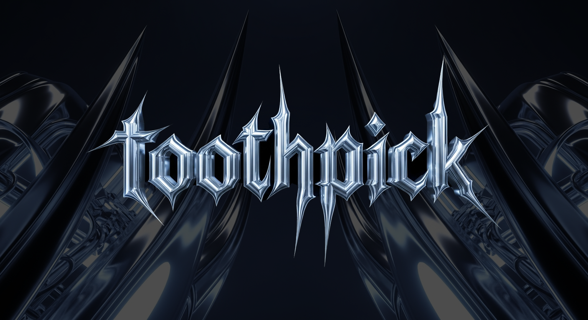
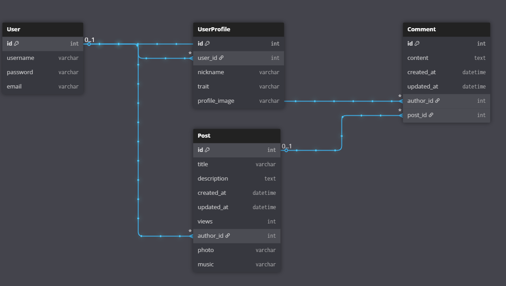
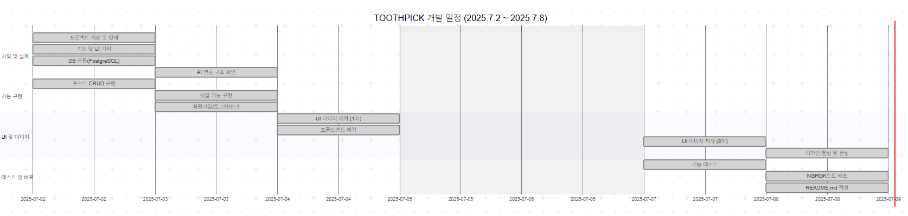

# 🪥 TOOTHPICK BLOG

> Gen-Z 세대를 위한 라이프스타일 블로그,  
> **"제한 속에서 피어나는 창의력"**  
> 블로그 같지 않은 블로그, TOOTHPICK입니다.
- 배포 주소: [https://fbc0cd03ebd4.ngrok-free.app/]



---


## 📌 기획의도 및 프로젝트 개요

TOOTHPICK BLOG는 Z세대의 라이프스타일과 감성에 집중하여, **"Y2K Chrome Art"** 감성으로 기획된 실험적인 블로그 플랫폼입니다.  
전통적인 블로그 서비스의 친절함과 정돈된 UI/UX에서 벗어나,  
**불편함조차 컨셉으로 삼아 사용자에게 신선한 불쾌감(?)을 주는 것을 목표로** 개발하였습니다.

---

### 🎯 왜 이런 블로그를 만들었을까?

사용자가 네이버 블로그, 티스토리 등이 아닌
'왜 TOOTHPICK을 사용할까?'라는 고민에서 시작되어

TOOTHPICK BLOG는 다음과 같은 세 가지 기획 의도를 바탕으로 설계되었습니다:

1. ### 📱 스마트폰 UI처럼 불편하지만 매력적인 구성
   최근의 스마트폰 UI나 앱들은 사용자의 패턴을 고려해 편의성은 높지만, 때론 불친절하거나 명확하지 않은 요소들이 오히려 감각적이고 매력적으로 느껴지기도 합니다.  
   TOOTHPICK BLOG는 이런 감성을 그대로 가져와, 정보를 일부러 숨기고, 불편한 동선을 제공함으로써 오히려 사용자가 ‘왜 이렇게 만들었지?’를 고민하게 만듭니다.

2. ### ✍️ “짧게 쓰는 것이 더 어렵다” - Mark Twain
   마크 트웨인은 “편지를 짧게 쓸 시간이 없어 길게 쓴다”고 했고,  
   삐삐(Pager)는 제한된 숫자 안에서 무한한 감성과 창의력을 발휘할 수 있게 했습니다.  
   TOOTHPICK BLOG의 글자 수 제한(제목 10자, 본문 15자, 댓글 10자)은 의도적으로 사용자의 노력을 유도하고,  
   짧은 문장 안에 최대한의 의미를 담도록 설계되었습니다.  
   이는 단순한 표현 이상의 창의적인 글쓰기 실험을 가능하게 합니다.

3. ### 💿 Gen-Z 감성을 반영한 Y2K Chrome Art
   최근 올데이프로젝트, 에스파, 뉴진스 등 다양한 브랜드와 아티스트들이  
   Y2K + Chrome Art 감성을 시각적으로 활용하고 있습니다.  
   TOOTHPICK BLOG 또한 이러한 트렌드를 반영하여,  
   Z세대의 시선을 사로잡는 키치하고 메탈릭한 시각 요소를 적용했습니다.  
   이는 단순히 기능만 갖춘 웹사이트가 아니라, 시대성과 정체성을 담은 공간으로 자리잡기 위함입니다.

4. ### 🧭 TOOTHPICK은 블로그인가요, SNS인가요?

많은 분들이 TOOTHPICK BLOG를 처음 접하면,  
짧은 글과 감각적인 UI로 인해 SNS로 오해하시기도 합니다.

하지만 TOOTHPICK은 SNS가 아닌 블로그입니다. 
그 이유는 다음과 같습니다:

- 일반적으로 SNS(Social Networking Service)는  
  사람 간의 연결(네트워킹)과 공유(Sharing), 양방향 소통에 중점을 둔 플랫폼입니다.  
  좋아요, 댓글, 실시간 반응 등이 중요한 구조를 갖고 있습니다.

- 반면 블로그(Blog)는  
  원래의 정의상 '개인의 홈페이지'로 출발하며,  
  주로 정보나 일상, 전문적인 지식을 기록하고,  
  일방향 소통을 전제로 합니다.  
  독자가 존재하지만, 실시간 반응보다는 기록과 축적이 핵심입니다.

TOOTHPICK은 후자에 더 가깝습니다.  
팔로우, 좋아요 기능 없이,  
사용자가 스스로의 기록을 남기고 정체성을 표현하며,  
짧은 문장을 통해 개인의 취향과 감성을 아카이빙하는 것을 목적으로 하고 있습니다.

따라서 TOOTHPICK은 ‘네트워킹’을 지향하는 SNS라기보다는,  
‘기록과 표현’을 위한 실험적 블로그 플랫폼으로 봐주시면 감사하겠습니다.

---

결과적으로 TOOTHPICK BLOG는  
> “제한 속에서 더 창의적인 표현을 유도하고,  
> 불편한 인터페이스를 통해 질문을 만들고,  
> 시각적으로도 Z세대의 문법을 따르는 실험적 블로그”  
로 설계되었습니다.


- 프로젝트명: TOOTHPICK BLOG  
- 타겟 유저: Gen-Z 세대  
- 슬로건: _불편함 속에서 발견되는_

---

## 🔧 핵심 기능

### 1. 블로그 포스트 및 댓글 기능
- 사용자는 글을 작성하고, 댓글을 남기며, 이를 자유롭게 수정/삭제할 수 있습니다.
- 모든 글과 댓글에는 글자 수 제한이 있으며, 짧은 콘텐츠에 더 많은 감정과 의미를 담도록 유도합니다.

### 2. 사용자 인증 기능
- Django의 인증 시스템을 활용하여 회원가입, 로그인, 로그아웃 기능을 제공합니다.
- 본인이 작성한 포스트와 댓글만 수정 및 삭제할 수 있도록 처리하였습니다.
- 유효성 검사를 통해 보안성과 사용자 편의성을 강화하였습니다.

### 3. 프로필 커스터마이징
- 사용자는 프로필 이미지를 업로드하고, 닉네임을 지정할 수 있습니다.
- 또한, 단 한 번만 부여 가능한 특성 형용사를 AI로부터 부여받아, 퍼블릭 프로필 상에 표현할 수 있습니다.

### 4. AI 특성 부여 기능
- 세 가지 성격 관련 질문에 답하면, pyhub-llm을 기반으로 생성된 형용사 특성을 부여합니다.
- 이 특성은 사용자에게 고유한 아이덴티티를 부여하며, 부여 후에는 수정이 불가능합니다.

### 5. 블로그 내 포스트 검색
- 사용자는 본인의 블로그 내에서 포스트를 검색할 수 있습니다.
- 태그나 키워드 필터링을 통해 관심 콘텐츠를 쉽게 탐색할 수 있습니다.

### 6. 음악 삽입 기능
- 글의 분위기나 라이프스타일에 맞는 음악을 선택하여 삽입할 수 있습니다.
- 사용자의 감성을 한층 더 풍성하게 표현할 수 있도록 돕는 기능입니다.

---

## ERD




## WBS


## ⚙️ 사용 기술 스택

| 분류 | 기술 |
|------|------|
| Backend | Django, PostgreSQL |
| Frontend | Tailwind CSS |
| AI 연동 | pyhub-llm (형용사 특성 생성기) |

---

## 명세
# 📄 Django 프로젝트 URL 명세서

| App       | URL Pattern                                           | View                      | Description               |
|-----------|--------------------------------------------------------|---------------------------|---------------------------|
| config    | admin/                                                 | admin.site.urls           | Django 관리자 인터페이스 |
| config    |                                                        | views.root                | 메인 페이지               |
| config    | logout/                                                | LogoutView.as_view        | 로그아웃 처리             |
| blog      | blog/<str:username>/                                   | views.post_list           | 사용자 블로그 글 목록     |
| blog      | blog/<str:username>/<int:pk>/                          | views.post_detail         | 게시글 상세 보기          |
| blog      | blog/<str:username>/write/                             | views.post_form           | 게시글 작성               |
| blog      | blog/<str:username>/<int:pk>/post/edit/               | views.post_edit           | 게시글 수정               |
| blog      | blog/<str:username>/<int:pk>/post/delete/             | views.post_delete         | 게시글 삭제               |
| blog      | blog/user/<int:post_pk>/comment/                      | views.comment_form        | 댓글 작성                 |
| blog      | blog/user/<int:comment_pk>/comment/edit/             | views.comment_edit        | 댓글 수정                 |
| blog      | blog/user/<int:post_pk>/comment/<int:comment_pk>/delete/ | views.comment_delete  | 댓글 삭제                 |
| accounts  | auth/register/                                         | views.register            | 회원가입                  |
| accounts  | auth/login/                                            | views.login               | 로그인                    |
| accounts  | auth/logout/                                           | views.logout              | 로그아웃                  |
| accounts  | auth/profile/                                          | views.profile_main        | 프로필 메인               |
| accounts  | auth/profile/edit                                      | views.profile_edit        | 프로필 편집               |
| accounts  | auth/profile/password                                  | views.password_change     | 비밀번호 변경             |
| accounts  | auth/profile/trait/                                    | views.assign_trait        | 설문 기반 특성 부여       |


## ✨ 프로젝트의 차별성

- 🎭 **AI 기반의 닉네임 생성 기능**
  - 사용자 설문을 기반으로 한 번만 생성 가능한 형용사+닉네임 조합
  - 블로그 정체성 강조, 개인화된 유저 프로필

- 🧷 **불편한 UI, 그 자체가 컨셉**
  - 일반적인 블로그 UI와는 다른 낯설고 독특한 경험 제공
  - 의도된 불친절함과 정보 최소화 UI

- ✂️ **콘텐츠 글자 수 제한**
  - 제목: 10자 / 내용: 15자 / 댓글: 10자 / 이미지: 1장
  - 간결하고 직관적인 표현의 훈련을 유도

---

## 🧪 서버 실행 방법

### 1. Django 서버 실행

```python
python manage.py runserver
```

### 2. ngrok 서버 실행
```python
ngrok http 8000
```
위 명령어 실행 후, 터미널에 출력되는 https://xxxxx.ngrok-free.app 주소를 통해 외부에서 접속이 가능합니다.

## 🚧 트러블슈팅 & 도전 과제

### 💭 1. 기획 방향 고민

단순히 작동하는 블로그를 만드는 것이 아닌, 이미 활성화 된 네이버 블로그, 티스토리, 벨로그 등을 사용하는 것이 아닌,
‘왜 이 블로그를 써야 하는가?’에 대한 답을 주는 플랫폼을 만들고자 했습니다.

- 블로그 같지 않은 레이아웃  
- 제한된 콘텐츠 길이  
- 의도된 불친절함  

이러한 요소들을 토대로 ‘TOOTHPICK’이라는 독특한 컨셉이 완성되었습니다.

---

### 🧩 2. AWS 배포 실패 → ngrok 대체

- AWS Lightsail에서 PostgreSQL 연동 시 비밀번호 불일치 등의 문제로 배포에 실패하였습니다.  
- 여러 해결 시도를 거쳤지만 결국 ngrok을 통해 테스트 배포를 진행하였습니다.

---

### 🐘 3. PostgreSQL 마이그레이션 오류

- 초기 모델 생성 후 마이그레이션 시 지속적인 오류가 발생하였습니다.  
- `.db`를 삭제 후 재생성하는 방식으로 해결하였으며, 이후에는 무리 없이 개발을 진행할 수 있었습니다.

---

## 🌱 느낀 점 & 향후 계획

- 🎨 AI로 UI를 생성해보는 실험은 흥미로웠지만,  
  명확한 목적 없이 생성된 디자인은 원하는 결과를 얻기 어려웠습니다.  
  앞으로는 프론트엔드 개발자와 협업하여 보다 정제된 UI를 설계해보고 싶습니다.

- ☁️ AWS와 도메인을 활용한 정식 서비스 형태로 배포하여,  
  포트폴리오로서 활용할 수 있는 수준까지 발전시키고 싶습니다.

- 💪 지금까지 배운 기술을 종합하여 하나의 웹 서비스를 구현해낸 이번 프로젝트를 통해  
  기술적 자신감이 생겼고, 향후 Final Project에도 큰 동기부여가 되었습니다.